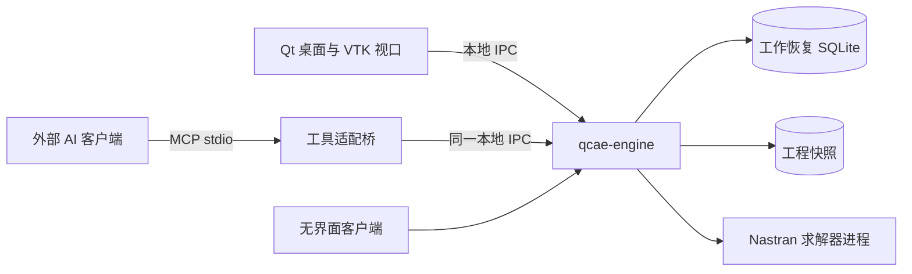

# QCAE

面向本地中小规模模型的 CAE 前处理平台。P0 聚焦受控 Nastran 悬臂梁流程，提供桌面 GUI 与外部 AI 共用的无界面业务接口；服务器和亿级实现后置。

**当前状态：设计基线 1.1，尚无产品实现。** 本仓库已保存需求、架构、接口契约、验收标准、参考研究和界面概念图。程序名称和源目录布局均为后续开发目标。

## 从这里开始

1. [设计基线与已确定决策](docs/baseline/README.md)
2. [P0 需求](docs/baseline/requirements.md)
3. [模块及架构](docs/architecture/README.md)
4. [接口契约](docs/contracts/README.md)
5. [开发计划](docs/baseline/development-plan.md)
6. [验收标准](docs/baseline/acceptance.md)



## 当前可执行的检查

需要 Python 3.10 或以上，无第三方 Python 依赖：

```sh
python3 tools/check_design.py
```

检查文档链接、JSON、依赖图、接口示例和需求追溯；不代表产品已编译或通过求解测试。当前不要运行尚不存在的 `qcae-engine` 或 CMake 产品构建命令。

## 仓库内容

| 路径 | 内容 |
|---|---|
| `docs/baseline/` | 当前需求、决策、组件、开发顺序与验收 |
| `docs/architecture/` | 当前模块、依赖、运行时与数据一致性 |
| `docs/contracts/` | 业务契约、操作描述和交互样例 |
| `docs/design/` | 界面概念图及生成提示词 |
| `docs/research/` | 架构参考研究，非依赖源码 |
| `docs/*-v0.*.md` | 历史讨论，不作为与当前基线冲突时的依据 |
| `tools/` | 文档与设计一致性检查 |

完整导航见 [文档索引](docs/README.md)。开发前阅读 [贡献与验证约定](CONTRIBUTING.md)。
