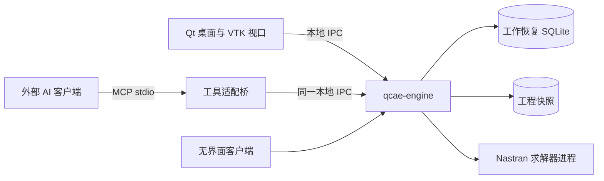

# QCAE

面向本地中小规模模型的 CAE 前处理平台。P0 聚焦受控 Nastran 悬臂梁流程，提供桌面 GUI 与外部 AI 共用的无界面业务接口；服务器和亿级实现后置。

**当前状态：设计基线1.1，M0内存核心和本地IPC已实现。** 已打通CLI到engine的材料参数预览、提交和undo/redo；完整P0、持久化、GUI、Nastran与AI接入尚未实现。运行入口见[M0说明](docs/implementation/m0.md)。

## 从这里开始

1. [设计基线与已确定决策](docs/baseline/README.md)
2. [P0 需求](docs/baseline/requirements.md)
3. [模块及架构](docs/architecture/README.md)
4. [接口契约](docs/contracts/README.md)
5. [开发计划](docs/baseline/development-plan.md)
6. [验收标准](docs/baseline/acceptance.md)



## 构建与测试

纯核心需要C++20编译器、CMake 3.24+和Python 3.10+，不需要Qt或其他产品框架：

```sh
cmake -S . -B build-core -DCMAKE_BUILD_TYPE=Release -DQCAE_BUILD_IPC=OFF
cmake --build build-core
ctest --test-dir build-core --output-on-failure
```

本地engine/CLI构建另需Qt6 Core/Network，启用`QCAE_BUILD_IPC=ON`，详见[M0运行与验证](docs/implementation/m0.md)。运行数据仅在内存，进程退出即丢失。设计检查仍可单独运行`python3 tools/check_design.py`。

## 仓库内容

| 路径 | 内容 |
|---|---|
| `docs/baseline/` | 当前需求、决策、组件、开发顺序与验收 |
| `docs/architecture/` | 当前模块、依赖、运行时与数据一致性 |
| `docs/contracts/` | 业务契约、操作描述和交互样例 |
| `docs/design/` | 界面概念图及生成提示词 |
| `docs/research/` | 架构参考研究，非依赖源码 |
| `docs/*-v0.*.md` | 历史讨论，不作为与当前基线冲突时的依据 |
| `include/`、`src/`、`apps/` | M0纯C++核心及本地Qt IPC入口 |
| `tests/` | 核心、契约、分配失败和真实IPC回归 |
| `tools/` | 操作描述生成与设计一致性检查 |

完整导航见 [文档索引](docs/README.md)。开发前阅读 [贡献与验证约定](CONTRIBUTING.md)。
