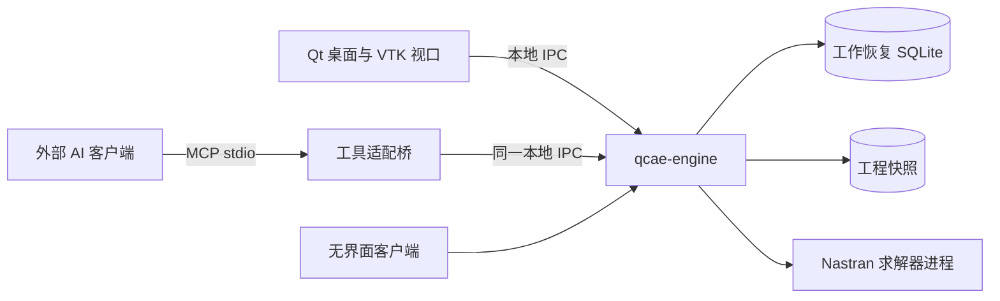

# QCAE

面向本地中小规模模型的 CAE 前处理平台。P0 聚焦受控 Nastran 悬臂梁流程，提供桌面 GUI 与外部 AI 共用的无界面业务接口；服务器和亿级实现后置。

**当前状态：核心框架已有可运行的本机交付包。** C1/C2、NEXT-01—03及C3几何/网格桌面工具已实现；统一事务/历史、SQLite保存恢复、CLI/GUI/MCP共享engine已贯通。五个工程生命周期入口的输入合同与实际贡献的codec/显示装配已补齐，本轮265项适用测试和包内SQLite、双MCP、真实桌面验证通过。运行见[本机交接](docs/implementation/core-local-handoff.md)，范围见[验证记录](docs/engineering/core-local-delivery-2026-10-03.md)。

后续优先收敛六类实际贡献的发现信息、其余legacy合同及核心正式验收；真实求解、完整外部AI、完整SK、容量/性能及P0发布仍未验收。顺序与原约束见[开发计划](docs/baseline/development-plan.md#c2之后的接续计划)。

## 从这里开始

1. [设计基线与已确定决策](docs/baseline/README.md)
2. [P0 需求](docs/baseline/requirements.md)
3. [模块及架构](docs/architecture/README.md)
4. [接口契约](docs/contracts/README.md)
5. [开发计划](docs/baseline/development-plan.md)
6. [验收标准](docs/baseline/acceptance.md)

阅读现有实现可从[平台框架逐文件导读](docs/engineering/code-walkthrough/README.md)开始，按构建/入口、数据/提交、业务功能、查询/存储/桌面的顺序阅读当前生产源码与配置文件。



## 构建与测试

纯核心需要C++20编译器、CMake 3.24+和Python 3.10+，不需要Qt或其他产品框架：

```sh
cmake -S . -B build-core -DCMAKE_BUILD_TYPE=Release -DQCAE_BUILD_IPC=OFF
cmake --build build-core
ctest --test-dir build-core --output-on-failure
```

本地engine/CLI启用`QCAE_BUILD_IPC=ON`，SQLite持久化启用`QCAE_BUILD_STORAGE=ON`，桌面另启用`QCAE_BUILD_DESKTOP=ON`并配置带Qt支持的VTK。运行`./build-desktop/qcae-desktop`启动工作区，详见[M2/M3构建与运行](docs/implementation/m2-m3.md)。不传`--workspace`的独立engine仍为内存模式。

## 仓库内容

| 路径 | 内容 |
|---|---|
| `docs/baseline/` | 当前需求、决策、组件、开发顺序与验收 |
| `docs/architecture/` | 当前模块、依赖、运行时与数据一致性 |
| `docs/contracts/` | 业务契约、操作描述和交互样例 |
| `docs/design/` | 界面概念图及生成提示词 |
| `docs/research/` | 架构参考研究，非依赖源码 |
| `docs/*-v0.*.md` | 历史讨论，不作为与当前基线冲突时的依据 |
| `modules/`、`features/`、`schemas/` | 通用核心、具体业务与生成契约 |
| `apps/`、`adapters/`、`profiles/`、`ui/` | 进程入口、外部适配、格式能力包及桌面 |
| `tests/` | 核心、契约、分配失败和真实IPC回归 |
| `tools/` | 操作描述生成与设计一致性检查 |

完整导航见 [文档索引](docs/README.md)。开发前阅读 [贡献与验证约定](CONTRIBUTING.md)。
