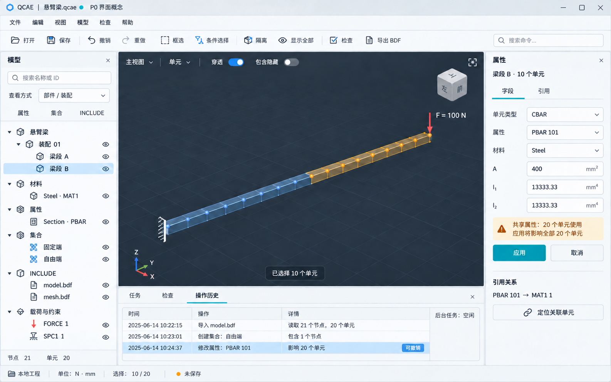

# P0 预期功能与界面说明 v0.4

> 历史讨论：本文件保留当时的分析与估算；当前开发依据为 [设计基线1.0](baseline/README.md)。冲突时不沿用本文件旧范围。

本文件描述计划交付的功能与界面概念，不代表已有可运行产品。延续已确认的本地中小模型、底层优先、逻辑前后端分离范围；桌面式布局用于本轮展示，不据此冻结客户端技术。

## 1. 用户可以完成什么

目标工作流程：打开工程或受支持的 Nastran 文件 → 浏览不同组织视角 → 查找、选择、隔离 → 修改悬臂梁参数 → 检查 → 撤销/重做 → 保存或另存 → 导出 BDF → 使用指定现有求解器验证。

| 编号 | 预期功能 | P0 操作与完成标准 |
|---|---|---|
| F01 | 工程文件 | 新建、打开、保存、另存；重新打开后模型与组织关系一致；未保存状态明确 |
| F02 | Nastran 交换 | 导入/导出明确方言与卡片子集，识别 INCLUDE；错误定位到文件/卡片，未知数据不静默丢弃 |
| F03 | 多视角组织 | 按部件/装配、材料/属性、集合、INCLUDE 查看同一模型；切换视角不复制实体 |
| F04 | 查询与集合 | 按类型、ID/范围、名称、归属、材料/属性和受支持字段组合条件；保存实体集合 |
| F05 | 精确选择 | 点选、框选、条件批选、反选；穿透与包含隐藏分开控制；显示选择数量及候选范围 |
| F06 | 基础显示 | 旋转、平移、缩放、适应窗口、显隐、隔离/恢复、颜色和高亮；相机操作不修改物理模型 |
| F07 | 最小参数编辑 | 编辑悬臂梁所需材料、截面、载荷和约束；明确区分修改共享属性与重新分配属性 |
| F08 | 引用与影响查询 | 从单元定位属性/材料，从共享对象定位全部引用者；删除或修改前展示影响范围 |
| F09 | Undo/redo | 撤销与重做模型修改，批量操作为一个整体；清楚展示历史、保存点与可撤销状态 |
| F10 | 基础检查 | 缺失引用、重复编号、非法字段、基本连接和算例完整性；点击问题定位相关对象 |
| F11 | 任务与恢复 | 进度、取消请求、失败原因、资源状态；恢复一致工程和已持久化修改，中断任务可识别 |
| F12 | 分析闭环 | 导出同一基础悬臂梁，交给指定现有 Nastran 求解器运行并核验位移/反力；不要求结果云图界面 |

无界面业务接口和 P1 脚本入口属于底层交付，主界面不额外展示开发者控制台或插件市场。

## 2. 主工作区布局

- 顶部：工程名、未保存标识、基础菜单，以及打开/保存、撤销/重做、选择、隔离、检查、导出入口。
- 左侧：模型浏览器、搜索框和组织视角切换；结构层级和可见性状态一起呈现。
- 中央：最大化的三维视口；实体类型、穿透、包含隐藏三个选择条件可见。
- 右侧：当前对象/选择范围的属性，以及引用关系。仅展示当前支持的字段。
- 底部：任务、检查、操作历史共用一个可折叠面板；状态栏显示单位、选择数量和工程状态。

布局采用浅色工具面板和深色三维视口；青绿色表示主要动作，琥珀色表示选择，红色用于载荷符号。颜色不是唯一状态信号，同时提供图标和文字。

概念图使用 21 节点、20 个一维梁单元的演示模型；梁截面实体外观只作为一维单元的显示表示，不代表新增实体网格划分能力。固定端符号、端部载荷箭头和部分选择用于说明交互，没有展示真实求解结果或性能指标。

## 3. 三个关键交互

### 选择与隔离

在模型树选中梁段 → 将选择类型设为单元 → 框选或按属性筛选 → 确认穿透/隐藏选项 → 显示选中数量 → 隔离。反选相对于明确候选域，例如当前部件，不隐含扩展到整个工程。

### 修改共享属性

选中 10 个单元并不必然意味着修改只影响这 10 个。若 PBAR 被全模型 20 个单元共享，界面必须明确提示共享属性及总影响数量，并能定位全部引用对象。仅改变选中单元时，使用独立属性后重新分配。概念图以“选择 10 个、共享属性影响 20 个”的情景展示这一边界。正式界面的影响数量应由核心引用查询返回。

属性面板的“应用”产生一个模型事务；“取消”丢弃尚未提交的表单内容。成功后模型视图与历史同步更新；撤销恢复字段及引用。

### 检查与长任务

点击检查 → 任务面板展示运行状态 → 问题列表显示规则、严重度和对象 → 点击定位 → 修改后复查。提交阶段与可取消计算阶段区分；任务运行时基础界面保持响应。

## 4. 概念与实现边界

界面图是 imagegen 生成的设计概念，按钮、数值、任务记录均为演示。它用于确认信息布局、密度、配色与功能入口，不作为像素级实现规格。

正式开发仍先完成文档、引用、查询、事务与任务接口，再接入界面。Nastran 方言、装配实例范围、恢复等级和具体模型规模仍按此前可行性分析锁定。

生成方式：内置 imagegen；完整提示词见 [生成提示词](design/qcae-p0-ui-prompt.txt)。定向修订提示词见 [修订提示词](design/qcae-p0-ui-edit-prompt.txt)。

## 5. 主工作区效果图

最终图通过了基于文字设计规范的布局、可读性与功能语义检查；没有外部参考图，因此不作为像素相似度比较。示意节点数量和任务记录不是运行数据。
