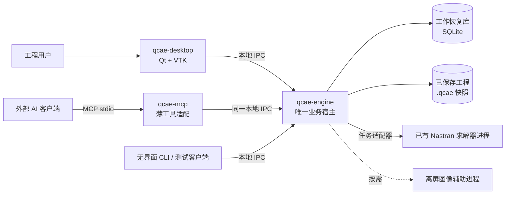
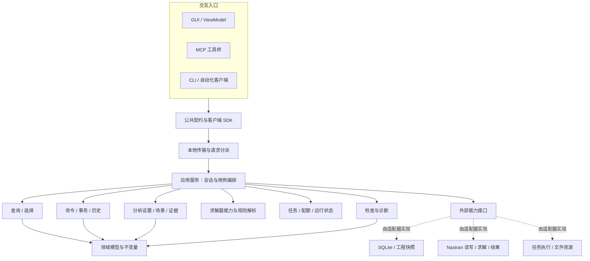

# QCAE P0 模块与架构设计 1.1

状态：已确定的开发设计基线；实现已交付至[C1/C2](../implementation/c2-handoff.md)，完整架构与P0仍待完成。依据已确认的本地中小模型、底层优先、Nastran 悬臂梁闭环、GUI 与外部 AI 共用能力的范围。本文作为当前架构依据，需求和验收以 ../baseline/ 下的基线文档配套；不恢复远程亿级路线。

## 文档入口

- [模块职责、接口与依赖](modules.md)
- [求解器能力包与多目标扩展边界](solver-profiles.md)
- [运行时、事务与持久化](runtime-and-data.md)
- [关键决策、实施顺序与架构验收](decisions-and-verification.md)
- [机器可检查的模块依赖清单](module-dependencies.json)
- [既有 AI 场景验收](../P0-AI验收用例-v0.6.md)

## 1. 需求与决策依据

| 已确认约束 | 架构对应 |
|---|---|
| [本地中小模型 P0](../P0本地平台可行性分析-v0.2.md) | 本机按需启动，不部署远程服务或分布式存储 |
| [GUI 与无界面能力分离](../P0本地平台可行性分析-v0.2.md) | 统一应用服务，核心不依赖窗口和渲染环境 |
| [多种组织关系](../P0本地平台可行性分析-v0.2.md) | 装配、部件、集合、INCLUDE、物理引用分开建模 |
| [Undo 与持久化](../P0本地平台可行性分析-v0.2.md) | 单写者、事务差量、工作恢复库、明确保存点 |
| [外部 AI 入口](../P0-AI接口与悬臂梁交付方案-v0.6.md) | MCP 桥与 GUI 接入同一本地核心进程 |
| [接口与结果证据](../P0-AI接口与悬臂梁交付方案-v0.6.md) | 显式版本、单位、幂等、任务状态与分析输入摘要 |

设计主线：**模块化的单个应用核心，配独立本地宿主进程；外部能力通过少量明确的适配接口接入。** 模块不等于微服务，也不要求每个模块成为独立动态库。

## 2. 运行部署图

以下为目标组件分工。qcae-engine、qcae-cli及Qt/VTK桌面已有实现；C2新增几何/网格从CLI/IPC调用，C3首个显示交互切片补上相同操作的GUI入口。MCP桥、真实求解器执行和离屏图像辅助进程仍待实现，图中的目标连线不代表这些能力已接入：

- **qcae-engine**：文档、事务、查询、分析、任务与恢复的唯一持有者。
- **qcae-desktop**：GUI、交互、视图状态和 VTK 显示缓存；不直接写工程库。
- **qcae-mcp**：外部客户端启动的 stdio 工具桥；发现并连接既有 engine，禁止自己建立另一份文档核心。
- **qcae-cli**：无 GUI 验收和批处理入口，可与测试客户端合并实现。
- **求解器进程**：受 engine 管理，读取冻结输入，产生任务产物。
- **离屏图像辅助进程**：按需提供截图能力，失败不阻断非图形业务；可在最小流程中后置。

选择独立 engine 的原因是 GUI 与 AI 已经需要并存、重连和无界面运行。同进程内嵌核心仍适合单一 GUI 演示，但当前容易形成 GUI 宿主/headless 宿主两套运行路径。这里多付出本地 IPC 和生命周期管理成本，换取一种业务所有权与恢复路径。

Qt 的 QLocalSocket 在 Windows 使用命名管道，在 Unix 使用本地域套接字，可作为本地 IPC 候选；QtCore/QtNetwork 只进入宿主及传输适配层。[Qt 官方说明](https://doc.qt.io/qt-6/qlocalsocket.html)

## 3. 逻辑分层图

图中实线主要表达调用关系；编译依赖严格从外部适配器指向核心定义的接口，核心不反向引用适配器。GUI 和 MCP 不直接链接业务实现。详细 DAG 见依赖清单。

## 4. 模块划分概览

| 模块 | 核心职责 | 权威数据/输出 |
|---|---|---|
| 公共契约 | 请求、响应、错误码、ID、量纲和能力描述 | 版本化 DTO；不保存业务状态 |
| 文档模型 | 节点、单元、材料、属性、组织关系、引用不变量 | 已提交文档快照 |
| 查询与选择 | 条件组合、关系/空间查询、集合运算、分页 | 带版本的结果集与句柄 |
| 命令与事务 | 预览、提交协调、幂等、历史、undo/redo | 变更集、事务、修订与历史游标 |
| 求解器能力包 | 按分析目标解析不可变定义、能力、专有schema、校验/映射规则 | ProfileRef与目标能力；P0只注册Nastran |
| 分析与场景 | 悬臂梁输入、单位、事实/假设、适用范围 | AnalysisSetup、场景状态与输入摘要 |
| 检查与诊断 | 基础模型检查、结果数值检查 | 带版本及依据的检查报告 |
| 任务与资源 | 队列、进度、取消、状态、配额 | Job 与资源引用；不直接修改模型 |
| 应用服务 | 生命周期、用例编排、调用者上下文 | 对外业务 API；唯一协调入口 |
| 存储与产物适配 | 工作恢复库、工程文件、另存、资源清单 | 持久化事务与文件资源 |
| Nastran 适配 | 格式读写、固定求解器启动、结果读取 | 导入候选、BDF、求解产物 |
| 显示适配 | 渲染数据转换、VTK 视口、精确 ID 映射 | 可重建显示缓存与截图 |
| 入口与宿主 | GUI/MCP/CLI、IPC、进程组装 | 连接与会话；不复制核心状态 |

P0 不自建全功能依赖注入框架、事件溯源框架或插件市场。用明确构造关系和少量端口即可。

## 5. 必须共同遵守的边界

1. 一份打开的工程只有一个 engine 文档实例、一个提交队列、一套历史。
2. GUI、MCP、脚本不能直接修改内存实体、SQLite、VTK 权威数据或求解输入。
3. 核心不包含 Qt/VTK/SQLite/MCP SDK 的公开类型。
4. 所有业务修改经过相同校验与原子提交；历史重放不能走另一条不校验的路径。
5. 内部 EntityId、Nastran 编号、存储偏移、渲染 ID 分开管理。
6. 文档修订、文档打开代号、分析输入摘要、视图版本分别表达不同一致性。
7. 大数据经批量、分页与二进制块通道；不逐节点做 JSON 调用。
8. 应用事件用于刷新和通知，不能替代当前状态查询；丢事件可以重同步。
9. 外部求解与文件发布不宣称属于同一个 SQLite 原子事务。
10. 核心可独立构建、启动和测试；图形上下文与 AI 运行时均可缺席。

## 6. 组件选择与预算影响

技术基线固定为 C++20、Qt 6 Widgets/Core/Network、VTK 和 SQLite 3；角色边界固定，当前已验证版本见[C2环境记录](../engineering/c2-validation.md)。独立本地 engine 引入 QtCore/QtNetwork 的宿主/IPC用途，仍是 Qt 组件，不把 Qt 引入领域层。MCP SDK 的语言选择延后到接入原型；如官方 SDK 使用辅助语言，桥接进程必须单独打包，不渗透核心接口。

OCCT、Netgen/Gmsh、HDF5 等不因架构预留就立即接入，保持按实际用例引入。图形只在 GUI/图像进程加载；P0 的基本线性梁流程无需 CAD 内核。

独立 engine 的 IPC、连接恢复、数据传输测试比早期“同进程亦可”的估算更具体，实施前需要用第一个运行时切片校准。既有 500万—1000万 token 仍是宽区间占位，不因本设计就认为足够，也不在缺少原型数据时再次随意增大总额。

## 7. 当前开放项

当前macOS工具链、SQLite恢复及有界历史/任务已有C2记录；待完成门禁包括目标硬件性能分档、跨平台验证、实际外部AI客户端及Nastran方言/真实求解器。重复实例装配、复杂CAD/网格、远程亿级、内置聊天仍不进入本轮。

架构文档中的职责与链路是目标合同；当前范围以C2、[NEXT入口一致性记录](../engineering/next-validation.md)及[C3首个显示交互切片](../engineering/c3-display-validation.md)为准。已实现入口补强及后续C3/C4顺序见[开发计划](../baseline/development-plan.md#c2之后的接续计划)。

## 后续参考研究

[Gmsh、CalculiX与FreeCAD FEM参考](../research/Gmsh-CalculiX-FreeCAD架构参考-v0.8.md)提供API定义、格式能力报告及变化影响分类建议。其中OperationDescriptor、格式转换报告、按引用传播的ChangeImpact已在设计基线1.1吸收；其余建议仍不自动引入依赖。

## 设计基线1.1补充

已接受[能力包边界](solver-profiles.md)：实体不内嵌单值求解器编号，分析绑定目标，公共物理类型与受控专有扩展分开，输入/结果端口通用化，profile/映射版本进入预览、报告与运行依据。P0仍只有Nastran受控子集，不承诺跨求解器转换或无损往返。
