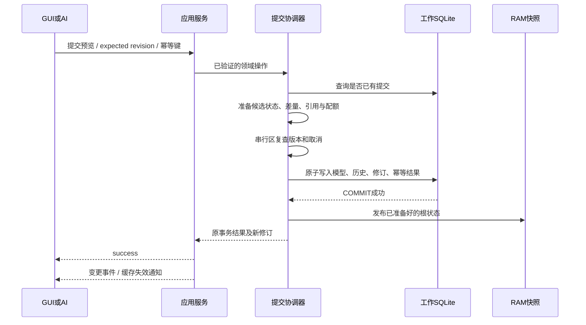
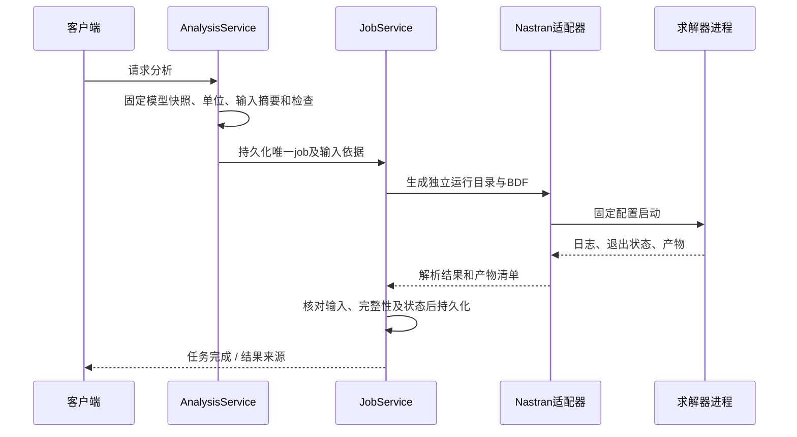

# 运行时、事务与持久化设计

本文件属于[设计基线1.1](README.md)，定义P0应实现和验证的行为。当前记录事务、SQLite迁移及持久线网格任务见[C2交接](../implementation/c2-handoff.md)和[记录合同](../engineering/r2-record-contract.md)。[M2/M3说明](../implementation/m2-m3.md)及其[ADR](m2-m3-decisions.md)保留该阶段历史取舍；以下完整P0合同中的事件、批量传输和外部求解任务尚未验收。

## 1. 引擎发现、所有权与生命周期

P0每个本地用户/应用实例范围只启动一个engine，同时只维护一份活动可编辑工程。GUI、CLI和MCP桥使用同一个连接或启动流程：获得实例启动锁 → 探测端点并握手 → 已有实例则连接，未运行则启动。并发启动的失败方重新发现，不另外建立核心。

端点记录包含协议版本、engine启动代号和连接信息。不能仅凭PID或旧文件存在判断实例存活。连接限制在当前用户允许的本地端点，授权上下文由宿主建立；AI参数中的actor/approved字段不能赋予权限。

工程写锁与engine单实例锁分别存在。工程锁按规范路径及可用的文件身份判定，不单靠ProjectId或窗口标题；复制出来的文件可能有相同ProjectId但不是同一物理文件。已经被其他写入者持有的目标不得再作为第二个可写工程打开。

客户端断开只释放连接和视图订阅，不隐式取消已提交任务。关闭文档、取消任务和退出engine是不同操作。有运行任务或其他客户端时，GUI关闭不会直接杀死engine；无客户端、无任务且工作库已持久化时，可按明确的空闲策略退出并保留恢复状态。

MCP桥可以被每个外部AI客户端独立启动，但桥始终连接同一个engine。无界面先启动后再打开GUI，也只连接已有文档。

## 2. 请求、版本和连接恢复

关键身份：

| 字段 | 含义 |
|---|---|
| ProjectId | 工程快照身份与来源追溯，不作为唯一文件锁依据 |
| DocumentId | 当前工作文档/恢复库的稳定身份 |
| DocumentEpoch | 每次打开/恢复激活产生的新代号，阻止旧会话请求作用于重新打开的模型 |
| Revision | 当前激活文档中的单调提交序号；undo也递增 |
| ContentStateId | 模型、组织及分析上下文的业务内容状态，用于clean/dirty；不含保存路径、ProjectId或相机 |
| AnalysisFingerprint | 物理输入、TargetBinding/ProfileRef、单位、场景及映射/导出规则等的确定性摘要 |
| ProfileRef | profile_id、profile_version、definition_digest；不与本机RunConfiguration混用 |
| ViewSessionId / ViewRevision | 相机、裁切、显隐与临时选择所属视图及其版本 |

从.qcae正常建立工作副本时生成新的DocumentId及DocumentEpoch，不激活快照中旧的运行幂等命名空间或未完成任务。可携带历史作为历史数据加载；活动任务只能由其原工作库恢复。从现有workingDB故障恢复时保留DocumentId、幂等和任务事实，仅产生新DocumentEpoch。SaveAs仍是同一活动工作文档，保留DocumentId及幂等记录。

修改请求至少带DocumentId、DocumentEpoch、expected_revision、idempotency_key和明确操作参数。request_id仅用于一次通信尝试；重试换request_id但保留同一逻辑操作的幂等键。

文档修改的幂等记录按工作文档、可信调用者范围和键保存规范化参数摘要及原结果。

project.create/open/close等文档生命周期操作由宿主级工作区登记簿记录，键为可信调用者范围、操作名和idempotency_key，不以尚未知晓或已经关闭的DocumentId作为查找前提。operations.get支持host作用域（无需DocumentId）和document作用域（明确DocumentId），均按实际调用者权限过滤。

创建/打开先持久化宿主意图，预先分配目标DocumentId及工作库位置，再建立并验证工作库，最后登记完成及可重放结果。若响应丢失或宿主中断，重试按同一意图核对既定工作库，完成或报告中断，不分配第二份文档。宿主登记簿与工作库并非一个原子事务，工作库的意图ID/就绪标记用于恢复核对；不明确的状态返回待核实，不擅自重建。打开不同工程时不隐式关闭已有可编辑工程，应先显式关闭；同一工程可连接既有实例。

关闭操作先持久化宿主意图，按明确的保存/保留恢复/放弃策略处理文档与未结束任务，然后登记关闭事实；既有幂等事实至少保留到声明保证期结束。文档关闭后，host作用域仍可查回该生命周期结果。调用者范围在重连/恢复后可识别，不能采用每次连接都变化的临时连接ID。相同操作已经提交则返回原事务，不创建新修订；同键异参拒绝。即使原事务后来被undo，重试也只返回原提交事实，同时报告当前修订及当前效果状态，不重新应用。

DocumentEpoch不同的旧修改请求一律不直接执行。重连取得新epoch后，通过operations.get查询旧操作结果，再决定是否需要重新生成预览。这样既防止打开旧快照后修订号碰巧相同造成误提交，也不会因为连接丢失而重复修改。

客户端订阅DocumentChanged、JobChanged、HistoryChanged、IssueChanged。事件带序号/版本；发现间隙或重连时重新查询快照和任务，不能认为事件永久不丢失。过期预览/选择句柄返回错误，由调用者重建。

## 3. 线程与数据传输

engine的本地传输事件循环负责收发与分派。每个文档有一个串行提交队列，后台线程池负责解析、查询索引构建、检查和候选计算；读取使用不可变的已提交快照，不持有可写实体指针。

GUI线程只处理界面，VTK渲染资源在其规定的渲染线程/上下文中使用。提交或任务结果通过事件触发增量刷新，不能让工作线程直接操作Qt控件或VTK场景。

控制消息使用有长度边界和大小上限的结构化编码，带协议/应用契约版本。批量坐标、连接和显示缓冲走独立二进制帧或受控只读资源；P0允许批量复制，记录成本，不先实现共享内存或传裸指针。队列和缓冲设上限，拖动相机只保留必要的最新更新。

服务返回可显示缓存的版本/块标识及原实体映射；客户端不会下载全部业务对象来重建第二个可写模型。大列表分页，选择结果可保留在engine以句柄访问。

## 4. 三份模型状态

```text
用户保存的 .qcae 文件：明确保存的可携带工程快照
                ↑ 一致快照导出 / 打开时初始化
本地 working.sqlite：当前工作文档的持久化权威
                ↓ 启动恢复 / 提交成功后发布
RAM DocumentSnapshot：运行时只读/编辑基础
                ↓ 可重建
引用索引、空间索引、显示缓存
```

工作库保存模型、关系、有限历史、幂等结果、任务与资源索引。每次正式模型提交持久化工作库；定时保存不是额外绕过事务的通路。

已保存工程文件只在明确保存/另存时更新，便于保持未保存/放弃修改语义。未命名工程也有独立恢复库。P0可接受打开/保存时完整快照复制，不构建多版本文件系统。

拖动预览、未提交表单、临时选择可以只在内存。文件格式使用schema版本，未知未来版本不静默覆盖。恢复库损坏或不兼容时进入诊断/只读恢复流程，不能把空模型误当成功恢复。

SQLite事务提供数据库内原子性；是否使用WAL及同步配置在持久化原型固定。WAL文件不能忽略，数据库备份使用官方一致快照能力，不能直接复制正被写入的主文件。[SQLite WAL](https://sqlite.org/wal.html)、[Backup API](https://sqlite.org/backup.html)

## 5. 一次修改与撤销的提交链



关键约束：

- DB提交前准备完整可发布状态、必要索引和历史数据，做完可能否决操作的业务校验。P0可对小容器复制，批量数组逐步按变更块优化。
- 一个SQLite事务写入模型/关系、新Revision、内容状态、历史及游标、可信来源、幂等结果，以及关联任务的提交结果。
- COMMIT之后只做无需新大额分配的根状态发布；发布前后由串行协调器保证一致性，不让查询混读旧模型与新历史。
- 返回成功表示达到声明的持久化边界。若数据库提交结果不确定，先停止该文档继续写入并核对事务事实，禁止直接重执行。
- 通知和显示缓存失败不撤销已经完成的模型事务；缓存可以失效重建。

| 崩溃窗口 | 恢复行为 |
|---|---|
| DB提交前 | 原状态有效，候选丢弃 |
| DB已提交、RAM未发布 | 从工作库恢复新状态，操作实际已提交 |
| RAM已发布、响应丢失 | 幂等查询返回原事务 |
| 模型已提交、显示刷新失败 | 模型保持新状态，客户端重新查询/构建缓存 |

Undo/redo经过同一提交链：历史游标改变，但Revision继续增加。新编辑剪掉redo分支时，不连带删除重试保证期内的幂等记录。P0保留有限的持久历史；超限策略和保留量需明确，不能悄然承诺无限历史。

## 6. 保存、另存和放弃修改

### 保存

1. 在文档队列中选定一致内容状态，登记save_operation_id、目标、快照身份。
2. 暂时排队新的模型写入，读取仍使用稳定RAM；用一致备份生成目标同文件系统的临时工程快照。
3. 清除快照中的活动锁/连接句柄，写入快照身份，验证模型、schema和必要资源。
4. 替换目标文件并按目标平台的持久化规则完成必要刷新。
5. 更新工作库保存标记，解除写入排队，返回保存结果。

原工程文件与工作库不是同一个原子事务。若替换成功但保存标记未更新，重启根据目标文件中的save_operation_id/ContentStateId判断事实，再修复工作库标记。失败不能简单宣称全部回滚。

### 另存

先取得新目标的写权限/锁。在save intent中预先固定新ProjectId、来源ProjectId、目标路径和选定ContentStateId；生成的目标快照直接使用这些值，不先写旧身份再事后改库。

目标发布成功后，以一个工作库事务更新ProjectId/保存位置/已保存ContentStateId和save intent完成状态。纯路径及工程身份更新不增加模型Revision或ContentStateId，也不进入模型undo；发布ProjectMetadataChanged事件。断点恢复用intent与目标快照核对完成事实。

EntityId、DocumentId及本次激活的DocumentEpoch保持不变。分析输入摘要不因纯保存路径变化而失效。正在运行的任务继续绑定冻结输入和其原运行目录。

### 放弃修改

按明确关闭/放弃操作关闭工作副本，或从已保存快照重新建立工作状态；后者按正常打开建立新的DocumentId/DocumentEpoch，旧预览失效。被用户明确放弃的恢复库不能下次再自动弹出为未保存工作。若还有未结束任务，先取消并收敛，或将原工作库标为retired并保留到任务终态；不能立即删除原库和运行目录。旧结果仅登记在原运行上下文，不自动附到新激活文档。不得靠逐条undo伪造恢复到工程文件。

### 项目可携带性

.qcae内保存必要模型数组、关系、分析上下文和结果数值摘要；源INCLUDE内容/组织以工程内记录管理。原始求解日志、大结果和图像可以在独立资源目录，工程保存其清单与hash。复制工程后若外部产物缺失，明确返回“摘要可用/原始产物缺失”，不能把路径记录视为文件已经携带。打包所有资源不属于P0默认新增能力。

## 7. 求解与外部产物链



所有任务输入和PreparedChange绑定(DocumentId, DocumentEpoch, Revision)。目标相关任务/预览另外冻结analysis_id、ProfileRef及能力摘要；提交时复查这些定义，不能因为文档修订没变就忽略profile升级。成功操作的幂等重试返回原事实，不重新按新版规则执行。会修改模型的任务提交时三者一起检查；旧任务不能仅凭相同数字修订写入重新打开的文档。求解旧输入允许完成，但只登记原AnalysisRun。

任务状态为queued、running、cancel_requested、committing、succeeded、failed、cancelled、interrupted，以及必要的reconciling。客户端请求取消不等于已经取消；模型短提交区不可被任意打断。

求解前持久化启动意图，启动后记录进程身份与开始时间；不能只靠PID判定。启动与记录之间崩溃时，进入核实/中断状态，不自动再次启动。P0不宣称外部进程恰好执行一次。

每次任务有独立run_id目录。产物先临时生成，经检查后发布清单，再登记有效结果。结果包含输入快照、AnalysisFingerprint、ProfileRef与映射/导出规则版本、冻结ExportIdentityMap、实际求解器和RunConfiguration摘要、解析器版本、物理检查证据；ResultField记录单位、值形状、实体/积分位置、坐标基和工况/采样信息。退出码0不等于结果完整或检查通过。

求解期间用户修改模型不污染旧任务输入。旧结果仍可查看，但标记适用的输入/版本。重用结果要求输入和求解配置均匹配；纯相机变化不使结果失效。

导出BDF/多INCLUDE同样使用独立临时目标和完成清单；多文件逐个rename不构成原子发布。P0优先导出到新目录并在全部成功后发布完成标识。Undo只恢复模型，不删除已交付文件或撤销已完成求解。

## 8. 无界面与显示

本地engine无需加载VTK或创建图形上下文即可执行建模、查询、保存、校验与求解。GUI本地渲染从engine获取只读显示数据。engine侧render_data读取ReadView并生产定义于contracts的RenderPacket；GUI、VTK和离屏辅助进程只消费RenderPacket/ViewSpec，不链接render_data或domain。

需要精确可见性选择/截图时，由ViewService通过端口调用单独的图形辅助能力；它可以复用VTK适配，在专用进程运行。返回图像/可见ID附带模型、视图、相机和映射版本。没有图形能力时返回明确错误，基本数值业务继续可用。

几何显示映射可一对多，例如一个梁单元被截面可视化为多个三角形；拾取必须合并回真实FE实体。生成的三角形不得进入物理模型、检查计数或Nastran导出。

## 9. 必须验证的运行时场景

GUI先启动、AI先启动、同时启动、多个AI客户端；同一工程重复打开；GUI关闭而任务继续；重连丢事件；engine在事务不同窗口崩溃；另存中断；旧epoch请求；undo后请求重试；不依赖显示设备的完整悬臂梁流程。详细验收及规划见 [决策与验证](decisions-and-verification.md)。


## 10. 能力包与分析目标

AnalysisDefinition持有TargetBinding，UI切换编辑上下文不修改文档。实际变更绑定/profile升级必须显式预览与事务；扩展字段和其引用参加同一工作库提交/历史。旧任务继续使用冻结profile及输入，配置升级不能暗改既有运行。编号查询必须区分来源模型/namespace和目标导出映射，不能按单值SolverId读取其他目标结果。具体规则见[求解器能力包](solver-profiles.md)。
