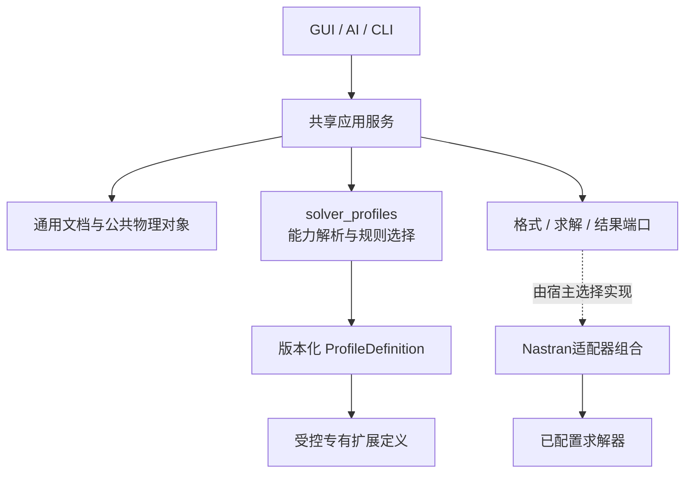

# 求解器能力包与平台差异：设计基线 1.1

状态：本轮接受的架构补充，产品尚未实现。用户同意“共享平台机制＋有限公共物理语义＋版本化求解器能力包”。本补充替换1.0中把单值SolverId、Nastran卡片和BDF写入公共模型/端口的表述；P0仍仅交付一个Nastran受控子集，不增加第二求解器、动态插件或通用跨模板转换产品。

## 1. 职责分配

| 层次 | 负责 | 不负责 |
|---|---|---|
| 平台机制 | EntityId、关系、单位、查询、事务、历史、任务、资源、恢复 | 按求解器分叉出多套平台 |
| 公共领域 | 已验证的网格、材料、截面、载荷/约束及分析语义 | 一次性抽象全部物理问题 |
| SolverProfile | 目标身份、能力、字段/schema、校验、交互约束和映射规则 | 绕过应用服务直接写数据 |
| 后端适配器 | 语义映射/文件读写、运行、结果解析 | 把输出成功等同于工程等价 |

表达/配置差异优先数据化；求解器特有能力进入受控扩展；新的物理过程需显式新增领域能力，不能伪装成仅替换模板。

## 2. 目标和配置是不同对象

### ProfileDefinition / ProfileRef

ProfileDefinition包含：profile_id、profile_version、definition_digest、solver_family、dialect、supported_solver_versions、analysis_kind、字段/实体/操作能力、扩展schema、映射/校验规则版本和结果能力。

ProfileRef是不可变引用：`profile_id + profile_version + definition_digest`。发布后不能保持这个引用不变而暗改规则；相同名称不同内容必须被识别。摘要涵盖影响解析、验证、导出或解释的代码/定义清单；独立实现版本在运行记录中同时保留。

P0只注册一个Nastran线性静力能力包。环境未解析的方言或求解器版本不能假装已经可用：区分declared、configured和validated；未配置/不匹配返回TARGET_NOT_CONFIGURED或TARGET_VERSION_UNSUPPORTED。

### AnalysisDefinition / TargetBinding

AnalysisDefinition是现有AnalysisCase的明确化名称，包含analysis_id、模型/网格引用、材料/截面分配、载荷/约束和当前受支持工况、输入事实/假设，以及TargetBinding。

TargetBinding包含ProfileRef、分析类型、显式的单元/材料等实现选项、受该目标拥有的专有扩展引用。它属于分析定义，不属于全局“当前求解器”，也不直接挂在每个网格节点上。

GUI活动分析/编辑视角可以改变，但不能隐式重解释整个文档。目标相关请求携带analysis_id；需要预期目标一致性的请求还携带expected_profile_ref，或引用已固定目标的preview/run。全局能力列举可不指定目标；针对某个目标的查询必须可解析到ProfileRef。

### RunConfiguration

RunConfiguration是本机执行配置：run_config_id、可执行资源、版本探测结果、受支持选项和资源预算。它与语义ProfileRef分离；更换二进制路径不自动变更模型语义，实际求解器版本必须满足能力包范围。

实际进程启动、版本和数值选项均进入运行摘要。旧的模糊字段solver_profile_id不再同时承担“语义模板”和“本机程序配置”两个含义。

## 3. 稳定身份、来源编号和导出编号

Node、Element、Material、Property的权威身份只有平台EntityId，不再拥有一个被全平台默认解释的SolverId。

| 对象 | 关键内容 | 生命周期 |
|---|---|---|
| SourceIdentifier | EntityId、import_id/source_model_id、来源资源、格式/profile、namespace及原编号 | 导入来源证据；可有多个来源记录 |
| NumberingPolicy | 目标ProfileRef、编号空间、保留来源编号/分配规则及冲突策略 | 显式配置，变化经过相关配置事务 |
| ExportIdentityMap | export_id/run_id、ProfileRef、namespace、外部编号、对应平台实体及必要派生角色 | 一次导出/运行的冻结产物，结果读取使用同一映射 |

namespace由格式语义决定，不能简单等于INCLUDE文件名。例如同一个Nastran模型图中的节点编号跨INCLUDE共享同一节点命名空间；节点与材料的同一数字不表示同一实体。导入多文件必须识别冲突，不能通过随意分文件命名空间掩盖重复编号。

通用映射契约允许明确的一对多/多对一及派生实体记录；P0已支持的梁子集默认要求可验证的一对一映射，其他情况报告不支持。不得把一次导出的临时编号回写成EntityId。外部结果先按冻结映射解析，再访问平台实体，不能按当前导出编号推测旧结果身份。

单纯生成导出编号不属于模型编辑；修改明确保留的编号策略或来源绑定则进入事务/历史。导出映射变化影响结果可复用性，但不凭此改变网格拓扑。

## 4. 公共语义与专有扩展

P0公共对象使用强类型工程含义，例如线弹性各向同性材料、梁截面参数、空间方向及节点力。卡片名、字段位置和求解器自由度编码属于能力包/适配器；不能将MAT1或PBAR当作所有求解器通用物理类型。

NativeExtension是受控的专有类型，至少有extension_id、owner_analysis_id、ProfileRef、qualified_type、schema_version、带类型/单位字段、可枚举的EntityRef引用和验证结果。P0只定义所需扩展契约；没有专有字段的对象不强制生成空扩展。

每个物理字段必须声明唯一权威来源：

- core_owned：公共物理对象权威；求解器表达是派生投影，不可独立编辑形成第二个值。
- extension_owned：该目标的专有字段权威；由能力包解释并通过同一事务修改。
- derived：可重建缓存；标记来源摘要，过期后重算，不持久化为另一份事实。

同一字段不能同时core_owned和extension_owned。Import读取两种互相矛盾表达时返回冲突诊断，不采用最后写入者胜出。

扩展必须支持字段校验、引用枚举、序列化、差量/恢复和ChangeImpact。Schema说明形状/单位/引用/可编辑性，程序规则处理复杂组合；GUI专用编辑器也通过相同命令校验。禁止将扩展作为任意JSON直写或插件自行提交数据库的通路。

缺失或不兼容的profile/schema不得悄然按最新定义打开为可编辑。P0对未知卡片/扩展严格拒绝受影响的编辑/导入或明确进入诊断只读；原文保留不等于语义可编辑，未知引用也不能安全地参与重编号。通用未知卡片往返不是P0新增功能。

## 5. 能力、检查与交互

能力按ProfileRef与分析类型解析，包括实体/操作/结果是否支持、前置条件、允许字段、选择类型/数量、单位、以及表单提示。GUI/AI/CLI读取同一能力；MCP层不得另建模板规则。

校验分三层：

1. 平台不变量：实体身份、引用、字段类型、单位和事务一致性，非法提交直接拒绝。
2. 目标模型规则：特定实现/参数组合及支持范围，影响分析是否就绪。
3. 场景与求解就绪：载荷、约束、运行配置、必要输出等是否完整。

建模中允许尚未完成的分析定义存在，但必须标为incomplete/invalid并给出诊断；导出可执行求解输入和启动求解必须通过相应门禁。不能因为一项分析尚未可求解而阻止所有无关工程编辑，也不能让不变量损坏的文档提交。

共享材料/截面被多项分析引用时，变更的影响按依赖传播至全部相关分析。公共字段在一项分析界面修改，并不意味着只影响这一项。P0可以通过同一profile下的多个测试分析或合成测试profile验证边界，不宣称交付第二求解器。

普通字段/引用选择由schema驱动；复杂操作允许专用编辑器，但语义规则必须能无界面执行。能力元数据不授予权限。缺目标/字段时返回needs_input；目标不支持时明确failed，不以默认当前GUI模板补齐。

## 6. 通用端口和目标适配

| 端口/能力 | 通用契约 | P0实际范围 |
|---|---|---|
| IProfileProvider | 不可变ProfileDefinition、扩展定义、目标校验及语义映射规则 | 一个静态注册Nastran包 |
| IModelCodec | 输入资源＋SourceContext→候选模型/来源映射/ImportReport；冻结分析＋ProfileRef→ArtifactPlan/ExportIdentityMap/ExportReport | 受控BDF/INCLUDE |
| ISolverRunner | 已核验ArtifactPlan＋兼容RunConfiguration→运行状态/产物 | 一个已配置Nastran环境 |
| IResultReader | 冻结运行/编号映射＋结果资源→ResultBundle及诊断 | 位移、反力及限定场景核验所需数值 |

ArtifactPlan包含格式、主文件与附属资源关系、选定目标/规则版本、输入摘要、映射及转换报告。解析/语义映射/编码是不同职责，但P0可在一个nastran_codec内实现，不要求额外通用IR编译器。

ResultField至少描述quantity_id、单位/量纲、标量/向量/张量形状、component_names、实体或积分位置、坐标基、工况/步骤/采样轴、数值资源及来源。静力可以没有时间轴；P0仅实现所需字段。不能自动把积分点结果冒充节点结果，平均/外推或坐标转换必须显式记录为派生处理。

RunSnapshot固定AnalysisDefinition/模型版本、ProfileRef、映射/校验/导出规则版本、RunConfiguration及实际求解器版本、ExportIdentityMap、输入摘要和结果读取器版本。结果对当前模型可用，需要相关输入与语义依赖匹配；只比较网格或工程名不足。

## 7. 模板切换、迁移和外部转换

### 切换编辑上下文

GUI选择另一分析或查看其他能力，只改变客户端上下文；不转换文档、不产生模型undo，也不覆盖原结果。请求必须明确分析身份。

### 绑定/变更分析目标

新的TargetBinding是模型修改，需兼容性预览→报告→PreparedChange→统一提交/undo，并使相关检查、导出计划和结果判定重新计算。P0只允许已配置的一个profile，不因有通用结构就开放任意目标。

### Profile升级

旧文档继续引用原ProfileRef。新版能力包不能热替换活动预览/任务中的定义；升级为一次显式迁移，提供字段/语义变化报告，必要时在新分析或工作副本进行。不能仅递增版本号后假定所有旧字段等价。尚未实现工程格式，不存在本轮实际数据迁移。

### 跨求解器转换

转换是独立任务，输出新目标产物/分析候选、实体映射和报告，默认不覆盖源模型。报告逐项标记exact、conditional、approximate、unsupported；需要用户选择的条件和近似必须有明确处置，不能合并成无条件成功。

P0不实现跨求解器转换器。以后可以先走受控BDF→外部工具验证第二个目标；需要直接消费平台数据时，另定义版本化交换快照，不公开内部SQLite表作为长期外部协议。

## 8. 模块与依赖调整

增加一个纯C++逻辑模块solver_profiles，负责注册/解析不可变定义、能力上下文和规则分发，依赖types/domain/contracts/ports，不依赖GUI、数据库或具体Nastran实现。

IProfileProvider在ports定义，profile_nastran是静态适配提供者，由engine_host组装注册。query、commands、analysis、validation及application通过通用registry/port访问定义，不include具体能力包。Nastran的codec/runner/result组合仍由宿主注入；本轮不建设动态加载系统。

序列化采用core_schema与profile/schema版本分别记录。领域扩展数据、引用、目标绑定和来源映射均参加现有工作库事务/历史；导出/运行映射作为冻结产物管理，不引入第二条写入路径。

## 9. 版本与缓存规则

目标相关预览固定ProfileRef及能力摘要；提交同时检查DocumentId/Epoch/Revision与该profile引用。成功提交的幂等重试先返回原事实，不因profile后来改变而再次执行；新的请求必须按当前目标重新预览。

AnalysisFingerprint纳入物理输入、TargetBinding和有语义影响的profile/映射/导出规则。运行摘要另纳入实际求解器/资源数值选项和输入映射；解析与显示派生处理有独立版本。改变ProfileRef不能复用旧的“已通过”就绪诊断，即使当前几何相同。

## 10. 本轮交付边界

公共接口和分析对象按本设计实现可扩展边界；生产能力包、字段/结果支持仍只有一个Nastran子集。测试可用明确标注的合成profile检查隔离和映射，但不等于支持该求解器。

与1.0相比，这是数据归属和契约完善，不是立即新增多模板平台、插件生态或跨物理分析。实施顺序在M0定义类型/操作目标上下文，M1实现Nastran能力及映射，M2验证扩展差量/恢复，M4/M5验证运行和AI目标一致性。
