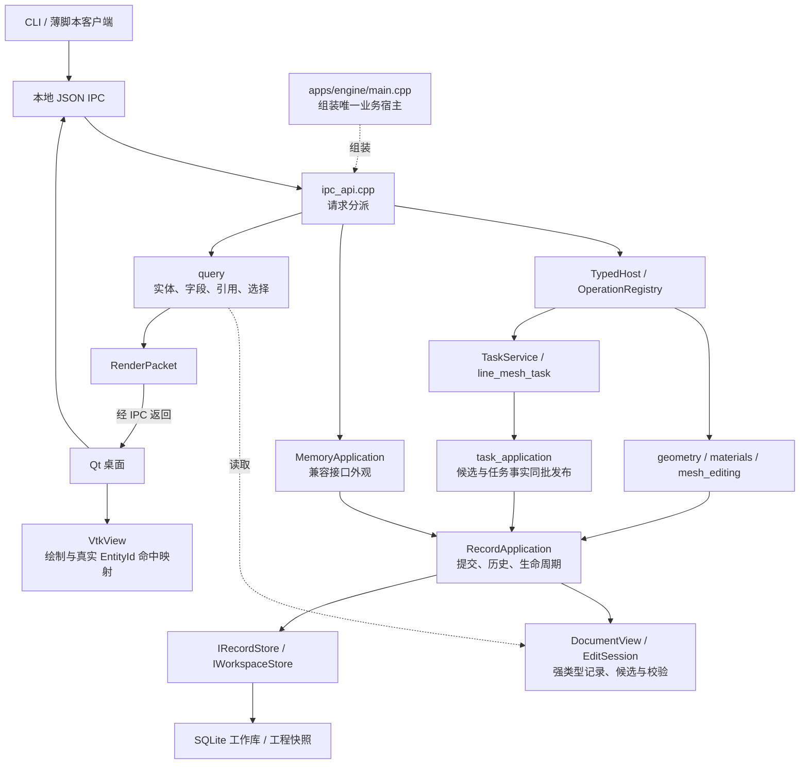

# 当前平台框架：逐文件阅读入口

这是对现有代码的导读，依据产品源码 `checkpoint/c2`（`8dba9e5`）及其后的扩展审查文档 `0186019`，整理于 2026-09-27。不会把 C3/C4 或完整 P0 的规划画成已经实现的能力。

阅读范围为根 CMake，以及 `apps/`、`modules/`、`features/`、`profiles/`、`adapters/`、`ui/`、`schemas/` 中全部生产 C++、CMake 与 JSON 文件：**109 个文件，包含 42 个头文件、39 个实现文件、24 个 CMake 文件、4 个 JSON 文件。** 四章对每个 C++/JSON 文件单独说明职责、关键类型/函数与调用者，对模块 CMake 逐行列出目标及依赖；每项均可点击打开源码。测试夹具、构建产物、IDE 配置和历史研究文档不算在这 109 个文件中。

## 从一条真实请求看全局

下面是运行调用与返回数据流，不是 CMake 编译依赖图。Qt/VTK 在外围，文档发布权集中在应用层；图中的 SQLite 只有传入显式工作库时才存在。

桌面已有基础编辑/显示链；C2 的几何创建与线网格任务当前通过 CLI/薄客户端调用，尚无对应 GUI 工具。外部 AI 的真实 MCP 桥、求解器运行和结果读取尚未接入，不放进当前实现图。

## 建议阅读顺序

| 顺序 | 文件导读 | 文件数 | 读完能回答的问题 |
|---|---|---:|---|
| 1 | [构建、公共契约与引擎入口](01-build-entry-contracts.md) | 24 | 各层怎样装配？文档/实体身份是什么？请求怎样进入业务？ |
| 2 | [文档数据、应用提交与任务运行时](02-data-runtime.md) | 37 | 谁拥有当前状态？编辑如何原子提交？undo/recovery/后台任务如何共用链路？ |
| 3 | [操作契约、参数工具与业务功能](03-operations-features.md) | 22 | 一个 typed 操作如何从 schema 走到真实记录变更？ |
| 4 | [查询、格式、存储与桌面](04-query-io-desktop.md) | 26 | 已提交状态如何查、存、交换、显示和准确选中？ |

第一次可以只读第一章的根 CMake、types.hpp、engine/main.cpp、ipc_api.cpp 和 typed_host.cpp。随后进入第二章的 `RecordApplication → EditSession → DocumentView`，再回头读生命周期和存储编码，避免一开始就陷入格式细节。

## 目录各自承担什么

| 目录 | 当前职责 | 不应放进去的内容 |
|---|---|---|
| `apps/` | engine、CLI、desktop 的可执行入口和组装 | 独立于共享应用的第二套模型/历史 |
| `modules/foundation`、`contracts` | 身份、版本、结果、跨层数据和外部端口 | Qt/VTK/SQLite SDK 类型 |
| `modules/document` | 强类型记录、只读视图、候选编辑、校验和旧格式桥 | GUI 菜单、socket 分派 |
| `modules/application` | 活动文档、提交、幂等、历史、保存/打开/恢复 | 具体网格生成算法、具体数据库操作 |
| `modules/operations`、`parameters` | typed 契约机制与纯参数工具 | 第二个事务管理器、任意实体字典 |
| `modules/runtime` | 后台队列、状态、取消、恢复及应用桥 | worker 直接发布文档 |
| `modules/query` | 当前记录/字段/引用查询、选择与显示数据生产 | VTK/OpenGL 图形上下文 |
| `features/` | 具体工程操作与旧 API 兼容 | 自行追加历史或直接写 SQLite |
| `profiles/nastran` | 受控格式编解码与能力定义 | 一般文档/历史机制 |
| `adapters/` | JSON IPC、SQLite、VTK、本地 endpoint | 绕过应用的业务写入 |
| `modules/clients`、`ui/desktop` | engine 客户端、窗口与交互 | 权威文档实例 |
| `schemas/` | 实体结构与 typed 输入的生成源 | 几何/网格算法本身 |

## 三个容易看错的地方

1. **兼容名不等于另一套核心。** `MemoryApplication` 内部只有同一个 `RecordApplication`；显式 SQLite 工作库下仍可持久化。旧 `Model`/`ModelSnapshot` 主要用于交换与迁移，但部分 IPC 查询仍经过旧投影，不能把新旧路径混为一谈。
2. **准备不等于提交。** `EditSession.prepare()` 与 worker 返回的 payload 都是候选。应用核对文档、epoch、修订、幂等与领域规则，再将数据/历史/事实持久化；成功后才发布当前视图。
3. **底层存在不等于界面功能完成。** 单位、坐标变换和一维表的计算工具已经存在；坐标/表的完整工程实体和编辑器尚未贯通。几何终点修改已有核心函数，typed IPC/GUI 入口尚未提供。

## 生成文件怎样阅读

| 源文件与生成器 | 生成结果 | 修改位置 |
|---|---|---|
| [实体 schema](../../../schemas/entities/entities.json) + [generate_entities.py](../../../tools/generate_entities.py) | [records.hpp](../../../modules/document/include/qcae/records.hpp)（已纳入版本管理） | 修改 schema/生成器，再生成并核验；不直接手改产物 |
| [typed 操作 schema](../../../schemas/operations/basic.json) + [generate_operation_contracts.py](../../../tools/generate_operation_contracts.py) | 构建目录 `generated/qcae/operation_inputs.hpp` | 修改输入契约，业务逻辑仍在 feature |
| [旧能力目录](../../contracts/operations.json) + [generate_operations.py](../../../tools/generate_operations.py) | 构建目录 `generated/qcae/operations.hpp` | 兼容能力目录；与 typed 目录尚未完全统一 |
| [generate_profile.py](../../../tools/generate_profile.py) | 构建目录 `profiles/nastran/generated/qcae/nastran_digest.hpp` | 根据能力定义及源码输入更新摘要；不是求解验证结果 |

## 验证材料从哪里看

这里给出框架相关测试的阅读入口，不对每个测试夹具展开第二轮逐行讲解。

| 关心的链路 | 实际文件入口 |
|---|---|
| 记录结构、引用、候选与增量 | [record_document_tests.cpp](../../../tests/record_document_tests.cpp)、[record_application_tests.cpp](../../../tests/record_application_tests.cpp) |
| schema/typed 解码与宿主注册 | [operation_registry_tests.cpp](../../../tests/operation_registry_tests.cpp)、[typed_host_tests.cpp](../../../tests/typed_host_tests.cpp) |
| 参数和工程操作 | [parameter_tests.cpp](../../../tests/parameter_tests.cpp)、[model_operation_tests.cpp](../../../tests/model_operation_tests.cpp)、[quantity_entry_consistency_tests.cpp](../../../tests/quantity_entry_consistency_tests.cpp) |
| 后台网格、取消、版本与发布 | [geometry_mesh_tests.cpp](../../../tests/geometry_mesh_tests.cpp)、[runtime_tests.cpp](../../../tests/runtime_tests.cpp) |
| 持久化与旧工程迁移 | [record_store_tests.cpp](../../../tests/record_store_tests.cpp)、[legacy_migration_tests.cpp](../../../tests/legacy_migration_tests.cpp)、[sqlite_tests.cpp](../../../tests/sqlite_tests.cpp) |
| 查询与格式 | [record_query_tests.cpp](../../../tests/record_query_tests.cpp)、[nastran_tests.cpp](../../../tests/nastran_tests.cpp) |
| 真实 CLI/薄脚本闭环 | [c2_workflow_tests.py](../../../tests/c2_workflow_tests.py) |
| GUI/视口 | [desktop_tests.cpp](../../../tests/desktop_tests.cpp)、[desktop_smoke.py](../../../tests/desktop_smoke.py) |
| 实际编译依赖与公开头文件 | [check_architecture.py](../../../tools/check_architecture.py)、[public_api_consumers/CMakeLists.txt](../../../tests/public_api_consumers/CMakeLists.txt) |
| 格式、设计与量化验收口径 | [check_cpp_format.py](../../../tools/check_cpp_format.py)、[check_design.py](../../../tools/check_design.py)、[check_skeleton_acceptance.py](../../../tools/check_skeleton_acceptance.py) |

运行步骤见[C2 交接](../../implementation/c2-handoff.md)，已执行产品检查见[C2 验证记录](../c2-validation.md)。当前扩展瓶颈与孤立实验见[C2 扩展审查](../extensibility-audit-c2.md)；完整 SK/P0 仍不能由本导读或若干单测宣称通过。

## 本次导读检查

109 个范围内文件均在四章中拥有一个源码链接，无缺失、无重复归属；导读相对链接已核对。两个独立只读审查覆盖全部章节，已修正批量 ID 重复拒绝、任务段数业务上限、查询兼容分支以及任务成功/失败发布边界的表述。C2 归档的 206 项源码摘要全部一致，本次只修改文档及索引；设计检查、C++ 格式检查与 diff 空白检查通过，没有重新运行产品构建、C++/IPC/GUI 测试或求解/AI 验收。
