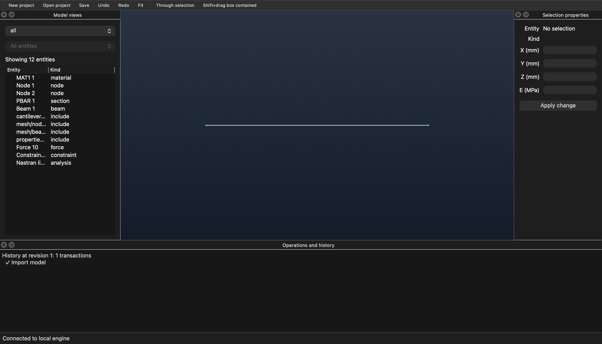

# M2 持久化与 M3 桌面实现

本轮在同一本地引擎上实现 SQLite 工作库、工程保存/另存/打开、明确恢复/放弃，以及查询、选择句柄、RenderPacket 和 Qt/VTK 工作区。GUI 通过异步 IPC 使用引擎的文档和历史。仍未包含求解器执行、任务系统或真实 AI 接入；完整 P0 容量及交互性能验收未完成。

## 启动与构建

已有构建可直接启动：

```sh
./build-desktop/qcae-desktop
```

桌面端自动连接或启动同目录下的 engine，工作库默认位于 Qt 的 AppLocalDataLocation 下的 `working.sqlite`。首次新建工程后每次成功编辑都会持久化；engine 重启后需明确选择 Recover。关闭窗口只断开桌面客户端，不结束独立 engine。

纯核心与格式测试，明确禁用外部产品框架：

```sh
cmake -S . -B build-core -G Ninja -DCMAKE_BUILD_TYPE=Release \
  -DQCAE_BUILD_IPC=OFF -DQCAE_BUILD_STORAGE=OFF -DQCAE_BUILD_DESKTOP=OFF
cmake --build build-core -j4
ctest --test-dir build-core --output-on-failure
```

无窗口持久引擎：

```sh
cmake -S . -B build-local -G Ninja -DCMAKE_BUILD_TYPE=Debug \
  -DQCAE_BUILD_IPC=ON -DQCAE_BUILD_STORAGE=ON \
  -DCMAKE_PREFIX_PATH=/opt/homebrew/opt/qt
cmake --build build-local -j4
```

运行 `qcae-engine --socket <绝对套接字路径> --workspace <工作库绝对文件路径>`；路径父目录应存在。CLI 自动启动也支持 `--workspace`。不传 workspace 保留 M0/M1 内存模式，能力发现会明确返回 `durable=false`，不能据此声称有重启恢复。

桌面构建：

```sh
cmake -S . -B build-desktop -G Ninja -DCMAKE_BUILD_TYPE=Release \
  -DQCAE_BUILD_IPC=ON -DQCAE_BUILD_STORAGE=ON -DQCAE_BUILD_DESKTOP=ON \
  -DCMAKE_PREFIX_PATH=/opt/homebrew/opt/qt \
  -DVTK_DIR="$PWD/build-vtk-deps/install/lib/cmake/vtk-9.7"
cmake --build build-desktop -j4
ctest --test-dir build-desktop --output-on-failure
```

本机环境：macOS 26.6.2 arm64、Apple clang/clang-format 21、Qt 6.11.1、SQLite 3.51.0、VTK 9.7.0。VTK 在被忽略的 `build-vtk-deps/` 隔离构建，没有修改全局 Homebrew 安装；代码仓库不提交 VTK 源码/二进制。其他机器可使用提供 `VTK::GUISupportQt` 的兼容安装，修改 VTK_DIR/Qt 前缀。

VTK 源码来自[官方发布页](https://vtk.org/download/)，9.7.0 归档 SHA-256 为 `affdb7a15ec34ee0174407f911ab70b646c7af01161818bbab4e1160b7eff720`。本机构建关闭 tests/examples/wrapping，Qt 版本为6，默认模块组设 DONT_WANT，显式启用 CommonCore、CommonDataModel、FiltersSources、RenderingCore、RenderingOpenGL2、InteractionStyle、GUISupportQt 及其传递依赖。

## M2：状态和一致性

| 对象/入口 | 行为 |
|---|---|
| 工作库 | SQLite WAL、synchronous=FULL；以带版本的二进制状态封装保存文档、模型、差量历史、幂等事实、保存意图和生命周期记录 |
| 模型提交 | 先准备完整候选与返回值，再原子提交工作库，最后以不可抛异常的 swap 发布 RAM；存储结果不确定时停止继续写入，要求恢复核实 |
| 历史 | 按实体集合记录有顺序信息的 before/after 差量；undo/redo 也走提交链；当前上限128条，超限拒绝，不隐式删除幂等事实 |
| 普通打开 | 从 `.qcae` 创建新 DocumentId/Epoch、revision=0 和新的编辑历史；保留平台实体身份，不激活原工作库幂等空间 |
| 故障恢复 | 保留 DocId/修订/历史/操作记录，生成新 Epoch；旧写请求拒绝，可用新 Epoch 查询旧操作事实 |
| 保存/另存 | 先持久化 save intent，生成独立完整 SQLite 快照，原子发布，再更新工作库保存标记；另存保持文档/实体身份和模型修订，分配新 ProjectId |
| 关闭 | `keep_recovery` 保留恢复状态；`discard` 清除恢复候选，保留宿主生命周期事实；两者都不通过逐条undo模拟 |
| 锁 | 工作库与工程路径分别持有进程租约；规范路径与 inode guard 阻止符号链接/硬链接别名重复写；替换文件后保留原 inode guard 至租约结束 |

项目快照仅包含工程模型、必要组织/来源和保存身份，不复制活动工作库文件及 WAL。工作库与目标文件仍非单事务；恢复用保存 token/目标快照核对发布事实。确定未发布或目标被替换时不伪称保存成功；未决保存意图会限制写入，原请求可按同一键继续或通过恢复核实。

损坏/未知版本状态明确拒绝，不把空模型当作恢复结果；读取差量历史会验证整条状态链。engine 注册当前 codec 的不可变 ProfileRef 验证器，不支持的分析或来源定义无法作为可编辑状态打开/恢复。不同路径的独立工程副本可以有相同 ProjectId，锁不把 ProjectId 当作唯一物理文件身份。

内部工作库格式2、项目封装格式1；尚无产品级迁移工具。SQLite 内封装格式与 ProfileRef 是两个独立版本层。具体实现取舍见 [M2/M3 ADR](../architecture/m2-m3-decisions.md)。

默认状态负载上限64 MiB；实体/关系限额延续M1，宿主与文档操作记录共用4096条配额。配额满时明确拒绝；不保证任意大模型容量。正常打开不携带旧历史；跨进程历史保证针对明确恢复的原工作库。

## M3：查询、选择与显示

- 条件查询：类型、实体ID、名称、来源编号范围、部件/装配/集合/INCLUDE 归属、材料/截面、世界坐标盒；AND/OR/NOT 组合。
- 选择：显式候选域、隐藏过滤、域内反选，以及选择句柄的交/并/差、分页读取。空间盒区分完整包含与相交，穿过盒子且端点在外的梁也可相交命中。
- 版本：句柄绑定调用者、DocId/Epoch、模型修订和 ViewRevision；相机/隐藏状态变化使旧句柄失效。会话身份含随机代号，重启不能碰巧复用旧句柄。
- 显示：engine 的纯 C++ producer 生成坐标/连接及真实 EntityId 映射；desktop 只消费 RenderPacket，不链接业务核心或 SQLite 适配。
- Qt 工作区：工程入口、模型多视角、实体属性、视口及历史；支持材料E和节点坐标编辑、undo/redo、BDF资源包导入、保存/另存/打开/恢复。
- VTK：节点与梁、相机旋转/平移/缩放、标准视图、适应窗口、高亮、隐藏/隔离/全显；Shift+拖动框选支持包含/相交。可见拾取由实际 VTK 渲染器产生候选，穿透使用投影几何判定。

GUI 不阻塞等待引擎回复，待处理请求有界；定时查询当前文档并按版本刷新。当前通过轮询恢复共享状态，尚无序号化推送事件。退出GUI不杀死引擎；若选择明确关闭/放弃则执行相应业务操作。

无图形引擎对 `visible_only` 返回 UNSUPPORTED_CAPABILITY。GUI 的 `picker_candidates` 是图形客户端提交的明确候选，核心检查身份/范围/版本，不把客户端列表当成服务器独立完成的遮挡计算。离屏可见性服务仍待实现。

界面实拍（真实 engine 导入仓库梁夹具，经 IPC 获取显示数据）：



## IPC 补充

`project.current` 取得当前文档；`project.open` 的 mode 明确为 normal（带 path）或 recover（不带 path）。`project.save/save_as` 接受 path，普通 save 可省略路径沿用已有保存位置。`project.close` policy 必须为 discard 或 keep_recovery。写请求延续版本/幂等约束。

`operations.get` 的 host scope 用原生命周期操作名查找结果；原 `project.open` 若为恢复，另带 `original_mode: recover`。返回旧操作事实不代表该旧文档目前仍活动，应重新查询 `project.current`。

新增 `view.create/update/render_data` 和 `selection.evaluate/combine/get`。除分页读取外都需要文档上下文及预期模型修订；更新视图和选择还需要预期 ViewRevision。完整可运行协议例子见 `tests/m23_ipc_tests.py`。

控制协议仍是有界 JSON 帧，渲染数据暂用同一1 MiB帧。超限明确失败，尚未实现二进制分块传输；GUI大列表有分页/显示范围提示，不能把当前小模型界面证据解释为十万级或亿级容量达标。

## 验证与剩余边界

回归证据登记在[验证记录](../baseline/validation-record.md)。已覆盖存储故障窗口、发布失败、别名锁、旧Epoch、幂等与历史恢复、真实CLI/engine重启、选择版本与VTK交互；真实工作区截图由 `tests/desktop_smoke.py` 生成，并验证GUI没有创建另一份模型。

一次 Release 测量中，1000节点世界坐标盒查询为0.504 ms，仅为该合成样例的单次结果。硬件分档、多规模分位延迟、帧率及资源压力验收尚未完成，ENV-04不能标为完整通过。

当前平台支持以本机macOS/POSIX验证为准，未提供Windows锁/发布与安装包保证。尚未实现的部分包括大批量传输、服务端离屏选择、完整事件订阅、工作区布局持久恢复、保存来源谱系的完整审计，以及M4任务/求解、M5 AI。M2/M3的本轮可运行实现不等同于全部P0退出条件通过。
