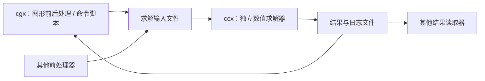
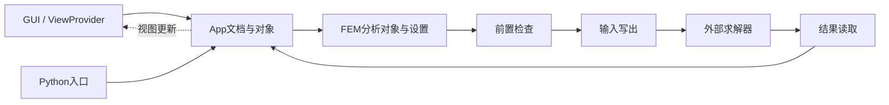

# Gmsh、CalculiX 与 FreeCAD FEM 架构参考 v0.8

日期：2026-09-25。性质：只读架构研究与建议，不修改参考工程，不安装组件、不编译、不运行求解或性能测试。QCAE继续采用已确认的本地中小模型P0、单一Nastran、底层优先、GUI与外部AI共用业务接口。

## 1. 证据范围

| 项目 | 本轮依据 | 限制 |
|---|---|---|
| Gmsh | 本地 /Users/qs/Documents/gmsh 的API、几何模型、入口、构建和BDF读写抽样 | HEAD 037c8d92e；CMake/API标记5.0.0且有开发后缀逻辑，不称作已发布正式版 |
| CalculiX | 用户确认无本地路径；作者官网、ccx/cgx 2.23手册、作者维护的ccx源码 | 手册与master源码不是固定同一版本，结论注明证据层次 |
| FreeCAD FEM | FreeCAD官方main源码和官方文档仓库 | 以App/Gui文档对象及FEM求解适配抽样为主，不作全仓库保证 |
| QCAE | [当前v0.7架构](../architecture/README.md) | 尚无产品运行实现 |

参考设计不等于直接复用代码或决定引入依赖；实际集成时仍核对选定版本、许可与构建成本。本轮不扩展求解器或CAD/网格范围。

## 2. 总体判断

- Gmsh：最适合借鉴API单源定义、批量数据接口和几何/网格后端边界。
- CalculiX：最适合借鉴前后处理与求解器的分工、文件契约和有类型的集合。
- FreeCAD FEM：最适合借鉴文档/显示职责分离、文档事务及外部求解流程。

它们各自解决的问题不同，都不能直接代替QCAE完整的工程模型、AI业务契约、持久事务与恢复设计。也不能从它们有脚本或批处理，就推导出具有QCAE需要的所有无界面保证。

## 3. Gmsh：API驱动的几何与网格系统

图是职责示意，不是所有算法的逐函数调用图。

### 值得吸收

**API单源定义。** 本地api/gen.py从统一定义生成C/C++、Python、Julia、Fortran及文档；基本类型和数组构成公共边界。[API说明](/Users/qs/Documents/gmsh/api/README.txt:9)、[生成器](/Users/qs/Documents/gmsh/api/gen.py:19)

QCAE可以将已讨论的OperationDescriptor作为小型声明源，描述参数、单位、返回值、错误和操作副作用；生成或校验MCP工具schema、帮助和接口样例。P0只做当前所需输出，不建设多语言SDK产品。

**批量数据。** 节点/单元接口批量传标签、坐标和连接，避免逐实体调用；内部针对编号分布使用不同缓存。[批量节点API](/Users/qs/Documents/gmsh/api/gmsh.h:860)、[批量访问说明](/Users/qs/Documents/gmsh/api/gmsh.h:1048)、[缓存结构](/Users/qs/Documents/gmsh/src/geo/GModel.h:121)

QCAE继续采用批量查询/修改与二进制块，不让AI或本地IPC每次只处理一个节点。

**内核同步边界。** GEO/OCC修改后需要synchronize才能被相应内核外功能使用，同步有成本，适合批量后统一执行。[GEO约定](/Users/qs/Documents/gmsh/api/gmsh.h:2442)、[OCC约定](/Users/qs/Documents/gmsh/api/gmsh.h:3509)

后续若引入Gmsh，建议流程为：后端候选计算 → 同步 → 核验新旧实体映射 → 输出PreparedChange → QCAE事务提交。synchronize本身不等于undo、持久化或平台原子事务。

**几何实体与网格分类。** GModel/GEntity用点、边、面、体组织几何，并关联分类到实体上的网格节点；对未来几何—网格关联有参考意义。[GModel](/Users/qs/Documents/gmsh/src/geo/GModel.h:140)、[GEntity](/Users/qs/Documents/gmsh/src/geo/GEntity.h:55)

### 不宜直接照搬

- API存在全局当前模型，不能直接作为多客户端的文档身份。QCAE适配器必须显式选择、隔离或串行访问后端状态，不能假定多任务天然隔离。[getCurrent/setCurrent](/Users/qs/Documents/gmsh/api/gmsh.h:204)
- GEntity也包含显示、选择和绘制缓存；QCAE继续分离文档与RenderPacket。[GEntity成员](/Users/qs/Documents/gmsh/src/geo/GEntity.h:33)
- Physical groups是几何实体标签分组，不等同于部件、任意网格集合、材料属性及INCLUDE的全部关系。格式映射还可能收窄分组信息。[定义](/Users/qs/Documents/gmsh/api/gmsh.h:297)、[BDF映射](/Users/qs/Documents/gmsh/src/geo/GModelIO_BDF.cpp:370)
- 本地writeBDF写节点、单元和结束标记，不承担完整材料/截面/载荷/约束/工况链。它是网格格式能力，不能直接替代QCAE受控Nastran分析导出。[实现](/Users/qs/Documents/gmsh/src/geo/GModelIO_BDF.cpp:347)

Gmsh有明确的可选FLTK/GRAPHICS构建和Batch入口，值得用作无窗口验收参照；本轮没有实际构建验证。[开关](/Users/qs/Documents/gmsh/CMakeLists.txt:52)、[批处理入口](/Users/qs/Documents/gmsh/src/common/Main.cpp:47)

## 4. CalculiX：ccx与cgx必须分开看

作者官网明确ccx与cgx可独立使用；ccx是求解器，cgx是使用OpenGL的前后处理器。ccx采用基于Abaqus形式的输入，不是既定的Nastran模板。[官网](https://www.calculix.de/)

### 值得吸收

**可替换的求解器进程。** 平台生成输入、启动求解器、解释结果；求解器不需要拥有前处理器的界面和工程数据库。这支持QCAE已有IModelCodec、ISolverRunner、IResultReader和Job分工。

**每次运行的文件契约。** ccx命令行读取jobname.inp，产生dat、frd等文件；模型定义与分析步骤有明确组织。QCAE可为每次Nastran运行固定输入、配置、输出及日志清单，再加上版本/摘要和恢复记录。[ccx 2.23手册，第7节](https://www.dhondt.de/ccx_2.23.pdf)

**有类型的实体集合。** cgx区分几何与网格，并用集合操作局部对象；ccx也区分节点集和单元集。QCAE可以借鉴集合的操作语义，继续使用稳定EntityId并区分实体类型。[cgx 2.23手册，第2节](https://www.dhondt.de/cgx_2.23.pdf)

**计算数据与工程数据分层。** ccx源码使用坐标/连接/单元类型等数组，并由C/Fortran数值实现消费。可以参考批量计算表示，不能据此把求解器内部数组升级为整个工程模型。[作者维护的CalculiX.c](https://raw.githubusercontent.com/Dhondtguido/CalculiX/master/src/CalculiX.c)、[Makefile](https://raw.githubusercontent.com/Dhondtguido/CalculiX/master/src/Makefile)

### 需要保留的边界

cgx的fbd命令文件提供批处理能力，但2.23手册明确-bg只是抑制窗口，仍需图形能力。批处理不等于QCAE所要求的不加载图形环境的业务核心。[cgx手册，B.14](https://www.dhondt.de/cgx_2.23.pdf)

cgx手册中的Nastran交换有功能限制，材料与控制定义需要补充；其F06读取描述针对CHEXA位移/应力，不能当作当前一维梁结果链已经得到支持。[cgx手册，B.23](https://www.dhondt.de/cgx_2.23.pdf)

因此，本轮参考CalculiX的分工，不将ccx加入P0求解器范围，也不将cgx命令解释器作为AI核心接口。脚本回放、求解重启、项目undo与崩溃恢复分别是不同能力。

## 5. FreeCAD FEM：最相关的补充平台参考

**文档与视图职责分离。** 官方源码分别有App::Document和Gui::Document/ViewProvider，前者管理对象、属性和文档事务，后者管理可视对象、视图与交互。QCAE可以直接借鉴这个责任划分，继续采用领域模型→RenderPacket→VTK。目录分离不意味着所有App代码都没有基础框架依赖，也不直接证明全流程headless。[App文档源码](https://raw.githubusercontent.com/FreeCAD/FreeCAD/main/src/App/Document.h)、[Gui文档源码](https://raw.githubusercontent.com/FreeCAD/FreeCAD/main/src/Gui/Document.h)

**文档事务与稳定状态通知。** App文档具有事务、undo/redo与重算相关接口；源码还区分重算事件与文档重新稳定的通知。QCAE应在一致模型发布后通知GUI/AI，而不是让半完成的字段变更驱动外部操作。借鉴文档边界，并不把它的内存事务等同于QCAE的数据库持久化保证。[App文档源码](https://raw.githubusercontent.com/FreeCAD/FreeCAD/main/src/App/Document.h)

**分析设置独立于求解器执行。** FEM文档和当前ccxtools源码展示了分析对象、前置检查、写输入、运行外部程序和加载结果。QCAE可把这个闭环作为AnalysisService与适配器的参考，错误应保留结构化信息供AI读取。[FEM工作台文档](https://github.com/FreeCAD/FreeCAD-documentation/blob/main/wiki/FEM_Workbench.md)、[ccxtools源码](https://github.com/FreeCAD/FreeCAD/blob/main/src/Mod/Fem/femtools/ccxtools.py)

FreeCAD文档说明求解器二进制独立于FreeCAD，现有FEM链会写文件、运行并读取结果。[FEM安装与外部程序说明](https://github.com/FreeCAD/FreeCAD-documentation/blob/main/wiki/FEM_Install.md)

### 不照搬整个框架

FreeCAD面向完整参数化CAD和工作台生态，QCAE当前不需要完整特征重算、表达式或插件生态。应借鉴数据/视图、事务和求解流水线，而不是移植整套应用。

也不应把QCAE每个节点/单元都包装成重量级通用文档对象。这个建议针对QCAE未来规模，不是在断言FreeCAD当前按每个FE节点建立文档对象。

## 6. 对当前QCAE的具体调整建议

以下是建议，不自动改动v0.7架构或扩大已确认功能。

| 建议 | 参考来源 | 放入现有模块 | 当前优先级 |
|---|---|---|---|
| OperationDescriptor单一声明源，驱动能力/帮助/schema一致性 | Gmsh，亦与ArcherPre动作注册一致 | contracts / application | P0设计应明确，生成范围保持小 |
| 批量数组、分页与显式数据块 | Gmsh、ccx | query / contracts / render_data | 保持现有方向，先实测本地规模 |
| 输入/输出能力和语义损失报告 | Gmsh BDF、cgx Nastran边界 | nastran_codec / validation | P0必须，不能静默丢卡片/分组语义 |
| 实体类型与集合成员语义明确 | cgx、Gmsh physical groups | domain / query | P0必须，保持不同关系独立 |
| 变化影响分类：显示、物理输入、引用/组织 | FreeCAD文档/重算思路 | commands / validation / analysis | P0做小型分类表，避免每次全部重建 |
| 前置检查→输入→外部运行→结果解析→核验 | FreeCAD FEM、ccx/cgx分工 | analysis / jobs / solver / result_reader | P0悬臂梁闭环 |
| 后端批量修改后同步、校验映射，再交平台提交 | Gmsh geo/occ | 将来的几何/网格适配器 | 首次真实几何网格用例时实现 |

ImportReport/ExportReport建议至少描述已识别/已写出类型、未支持项、编号/分组映射、诊断和是否允许继续。这是现有格式适配与检查的完善，不是新建一个格式框架。

ChangeImpact建议先区分：仅视图变化、模型展示/组织变化、物理分析输入变化、引用/拓扑变化。与现有ContentStateId、AnalysisFingerprint、ViewRevision对齐，采用保守失效策略起步，不构建复杂增量重算引擎。分类应结合引用依赖判断，例如集合成员被载荷/约束引用时，集合修改也会影响物理输入，不能只按界面所在面板分类。

## 7. 对架构取舍的再判断

Gmsh和FreeCAD的例子说明：**完整API、批处理与数据/视图分离，首先是核心边界问题，并不天然要求核心独立进程。** QCAE选择独立本地engine，是为了GUI与外部AI共享活动文档、生命周期和历史，需要用运行时原型验证收益。

当前应保留稳定实体身份、明确组织关系、唯一提交、可恢复存储、结果依据与能力边界。进程发现、离屏辅助进程、协议生成器等设施保持最小化。不能因为参考项目功能广或QCAE图更整齐，就得出性能/可靠性胜负结论。

原型仍优先验证：一个文档、一个悬臂梁、GUI与外部AI读取同一状态、一次修改/撤销/保存/恢复、一个真实求解任务。参考项目带来的建议服务于这条流程。

## 8. 结论与证据边界

本轮值得借鉴的组合是：Gmsh的接口工程化，CalculiX的求解文件边界，FreeCAD FEM的文档/视图和分析流程，再结合此前ArcherPre的动作与选择语义。

没有修改参考仓库、替换Nastran、引入新依赖或执行求解。研究结论来自指定源码/手册抽样，未证明任何项目覆盖全部P0、亿级性能、持久化原子undo或AI全流程可靠性。
